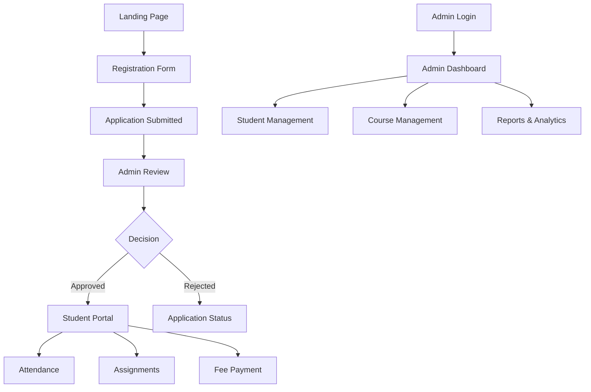

## 1. Product Overview

Clone of Saylani SMIT registration system with complete student portal and admin dashboard functionality. The system enables student registration, course management, attendance tracking, and administrative oversight for the Saylani Mass Training Institute.

Target users include prospective students seeking admission to SMIT courses, enrolled students accessing their portal, and administrators managing the entire system.

## 2. Core Features

### 2.1 User Roles

| Role | Registration Method | Core Permissions |
|------|---------------------|------------------|
| Prospective Student | Online registration form | Can submit applications, track admission status |
| Enrolled Student | Admin approval of application | Can access student portal, view courses, attendance, assignments |
| Admin | Manual creation by super admin | Full system access, student management, course creation |
| Super Admin | System initialization | Complete system control, admin management |

### 2.2 Feature Module

Our Saylani SMIT registration system consists of the following main pages:

1. **Landing Page**: Hero section, course showcase, registration CTA, navigation
2. **Registration Form**: Multi-step form with personal info, educational background, course selection
3. **Student Portal Dashboard**: Attendance tracking, assignments, courses, fees, schedule
4. **Admin Dashboard**: Student management, course management, analytics, reports
5. **Login Page**: User authentication with role-based redirection
6. **Application Status**: Track admission application progress

### 2.3 Page Details

| Page Name | Module Name | Feature description |
|-----------|-------------|---------------------|
| Landing Page | Hero Section | Display SMIT branding with animated banner, course statistics, success stories carousel |
| Landing Page | Navigation | Responsive navbar with logo, menu items, language switcher (English/Urdu) |
| Landing Page | Course Showcase | Grid layout of available courses with duration, fees, and enrollment status |
| Landing Page | Registration CTA | Prominent registration button with deadline countdown timer |
| Registration Form | Personal Information | Collect full name, CNIC, date of birth, gender, marital status, phone, email, address |
| Registration Form | Educational Background | Previous education details, marks/grades, institution names, passing years |
| Registration Form | Course Selection | Multi-select course preferences with prerequisites validation |
| Registration Form | Document Upload | Photo upload (max 2MB, JPG/PNG), educational certificates, CNIC scan |
| Registration Form | Form Validation | Real-time validation with error messages, field-specific requirements |
| Student Portal | Dashboard Overview | Summary cards showing attendance percentage, pending assignments, current courses |
| Student Portal | Attendance Module | Daily attendance marking, monthly attendance report with percentage calculation |
| Student Portal | Assignments | View assigned tasks, submit assignments with file upload, track submission status |
| Student Portal | Courses | Current enrolled courses list, course materials download, progress tracking |
| Student Portal | Fee Management | Fee structure display, payment history, outstanding balance with due dates |
| Student Portal | Schedule | Weekly timetable with class timings, room numbers, instructor names |
| Admin Dashboard | Student Management | View all students, filter by course/batch, approve/reject applications |
| Admin Dashboard | Course Management | Create/edit courses, set capacity, assign instructors, manage schedules |
| Admin Dashboard | Attendance Management | Mark bulk attendance, generate monthly reports, send absence alerts |
| Admin Dashboard | Analytics | Student enrollment trends, course popularity, revenue charts |
| Login Page | Authentication | Email/password login with JWT token, role-based dashboard redirection |
| Application Status | Status Tracking | Real-time application status updates with timeline visualization |

## 3. Core Process

### Student Registration Flow
1. Student visits landing page and clicks "Register Now"
2. Fills multi-step registration form with personal and educational details
3. Uploads required documents including photo and certificates
4. Submits application and receives confirmation email
5. Admin reviews application and updates status
6. Student can track application status through portal

### Admin Management Flow
1. Admin logs in to access dashboard
2. Reviews pending student applications
3. Approves/rejects applications with comments
4. Manages course schedules and capacity
5. Monitors attendance and generates reports
6. Handles fee management and payment tracking

## 4. User Interface Design

### 4.1 Design Style

**Primary Colors:**
- Primary: #1e40af (Blue-700) - Header backgrounds, primary buttons
- Secondary: #f59e0b (Amber-500) - CTAs, highlights, important elements
- Success: #10b981 (Emerald-500) - Success messages, approved status
- Error: #ef4444 (Red-500) - Error messages, rejected status
- Warning: #f59e0b (Amber-500) - Warnings, pending status

**Typography:**
- Headers: Inter font, sizes 32px, 24px, 20px, 18px
- Body: Inter font, 16px regular, 14px for secondary text
- Arabic/Urdu: Noto Nastaliq Urdu font for local language support

**Layout Style:**
- Card-based layout with subtle shadows (shadow-sm, shadow-md)
- 8px base spacing unit (p-2, p-4, p-8 classes)
- Responsive grid system (grid-cols-1, md:grid-cols-2, lg:grid-cols-3)
- Top navigation with hamburger menu for mobile

**Button Style:**
- Rounded corners (rounded-lg, rounded-xl)
- Gradient backgrounds for primary actions
- Hover effects with scale transformation
- Loading states with spinner animations

**Icon Style:**
- Heroicons for consistent iconography
- Emoji support for status indicators ✅ ❌ ⚠️
- Custom SVG icons for SMIT branding

### 4.2 Page Design Overview

| Page Name | Module Name | UI Elements |
|-----------|-------------|-------------|
| Landing Page | Hero Section | Full-width banner with animated text, statistics counters, success stories carousel with auto-play |
| Registration Form | Personal Info | Two-column layout on desktop, single column on mobile, real-time validation with inline error messages |
| Student Portal | Dashboard | Summary cards with progress bars, quick action buttons, recent activity timeline |
| Admin Dashboard | Student Table | DataTable with search, filter, sort, bulk actions, pagination with page size selector |
| Login Page | Authentication | Centered card layout, password visibility toggle, remember me checkbox, forgot password link |

### 4.3 Responsiveness

**Mobile-First Design:**
- Base styles for mobile screens (320px+)
- Tablet breakpoints at 768px (md:)
- Desktop breakpoints at 1024px (lg:)
- Large screens at 1280px (xl:)

**Touch Interaction:**
- Minimum touch target size 44x44px
- Swipe gestures for carousels and galleries
- Pull-to-refresh for data updates
- Optimized form inputs with appropriate keyboards

**Performance:**
- Lazy loading for images and heavy components
- Progressive enhancement for JavaScript features
- Offline capability for critical features
- Optim