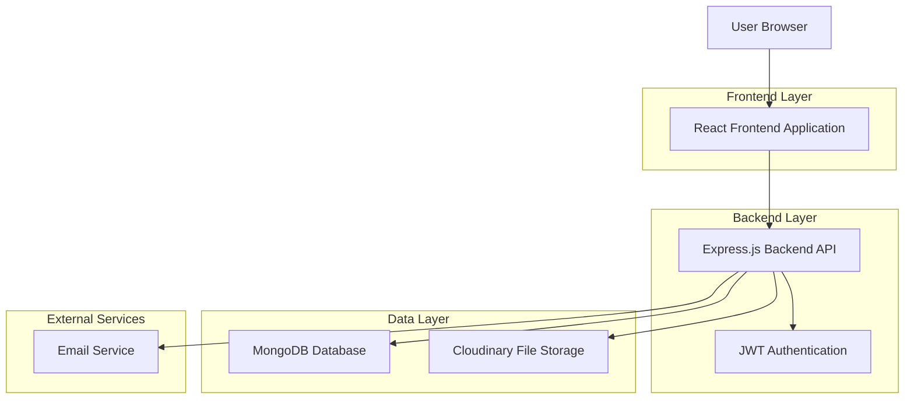
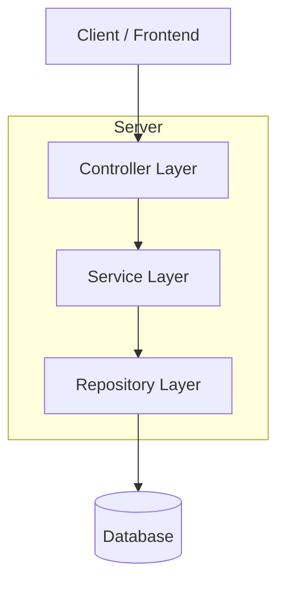
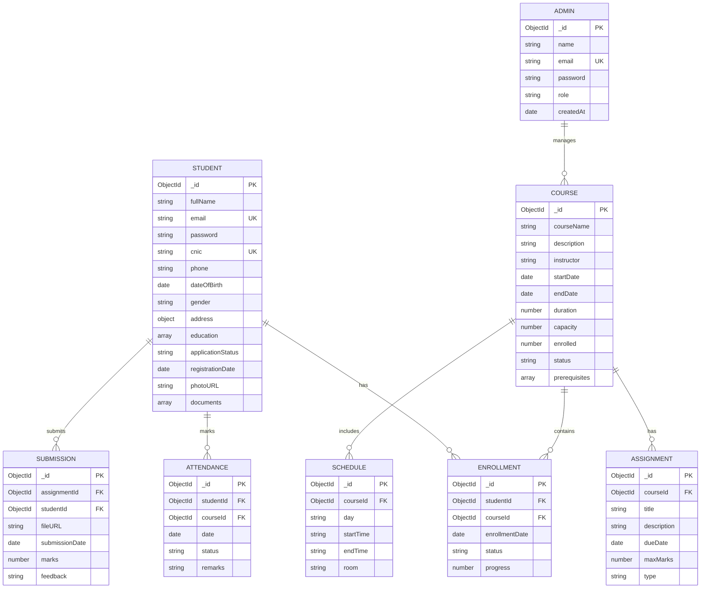

## 1. Architecture Design



## 2. Technology Description

**Frontend Stack:**
- React@18.2.0 + TypeScript@5.0.0
- Vite@4.4.0 for build tooling
- Tailwind CSS@3.3.0 for styling
- React Router@6.14.0 for navigation
- React Hook Form@7.45.0 for form management
- Zustand@4.4.0 for state management
- Axios@1.4.0 for HTTP requests

**Backend Stack:**
- Node.js@18.17.0 LTS
- Express.js@4.18.2
- MongoDB@6.0 with Mongoose@7.4.0
- JWT@9.0.0 for authentication
- Bcrypt@5.1.0 for password hashing
- Multer@1.4.5 for file uploads
- Nodemailer@6.9.0 for email service
- Cloudinary@1.38.0 for image storage

**Development Tools:**
- ESLint@8.45.0 for code linting
- Prettier@3.0.0 for code formatting
- Husky@8.0.3 for git hooks
- Jest@29.6.0 for testing

## 3. Route Definitions

**Frontend Routes:**
| Route | Purpose |
|-------|---------|
| / | Landing page with course showcase and registration CTA |
| /register | Multi-step student registration form |
| /login | User authentication page |
| /student/dashboard | Student portal main dashboard |
| /student/attendance | Attendance tracking and history |
| /student/assignments | Assignment submission and tracking |
| /student/courses | Enrolled courses and materials |
| /student/fees | Fee structure and payment history |
| /student/schedule | Weekly timetable and class schedule |
| /admin/dashboard | Admin overview with analytics |
| /admin/students | Student management interface |
| /admin/courses | Course creation and management |
| /admin/attendance | Bulk attendance marking |
| /admin/reports | Analytics and reporting dashboard |
| /application-status | Track admission application status |

**Backend API Routes:**
| Route | Method | Purpose |
|-------|--------|---------|
| /api/auth/register | POST | Student registration |
| /api/auth/login | POST | User authentication |
| /api/auth/refresh | POST | Refresh JWT token |
| /api/students/profile | GET | Get student profile |
| /api/students/attendance | GET | Student attendance history |
| /api/students/assignments | GET, POST | Assignment management |
| /api/students/fees | GET | Fee details and history |
| /api/students/schedule | GET | Class schedule |
| /api/admin/students | GET, PUT | Student management |
| /api/admin/courses | GET, POST, PUT, DELETE | Course management |
| /api/admin/attendance | POST | Bulk attendance marking |
| /api/admin/analytics | GET | Dashboard analytics |

## 4. API Definitions

### 4.1 Authentication APIs

**Student Registration:**
```
POST /api/auth/register
```

Request:
| Param Name | Param Type | isRequired | Description |
|------------|------------|------------|-------------|
| fullName | string | true | Student's full name |
| email | string | true | Valid email address |
| password | string | true | Minimum 8 characters |
| cnic | string | true | CNIC number format |
| phone | string | true | Phone number with country code |
| dateOfBirth | date | true | Format: YYYY-MM-DD |
| gender | string | true | "male" or "female" |
| address | object | true | {street, city, province} |
| education | array | true | Previous education details |
| coursePreferences | array | true | Selected course IDs |
| documents | object | true | Uploaded file URLs |

Response:
```json
{
  "success": true,
  "message": "Registration successful",
  "data": {
    "studentId": "507f1f77bcf86cd799439011",
    "applicationStatus": "pending",
    "trackingNumber": "SMIT2024001"
  }
}
```

**User Login:**
```
POST /api/auth/login
```

Request:
| Param Name | Param Type | isRequired | Description |
|------------|------------|------------|-------------|
| email | string | true | Registered email address |
| password | string | true | User password |
| role | string | false | "student" or "admin" |

Response:
```json
{
  "success": true,
  "token": "eyJhbGciOiJIUzI1NiIsInR5cCI6IkpXVCJ9...",
  "refreshToken": "eyJhbGciOiJIUzI1NiIsInR5cCI6IkpXVCJ9...",
  "user": {
    "id": "507f1f77bcf86cd799439011",
    "name": "John Doe",
    "email": "john@example.com",
    "role": "student"
  }
}
```

### 4.2 Student APIs

**Get Student Profile:**
```
GET /api/students/profile
```

Headers:
```
Authorization: Bearer {token}
```

Response:
```json
{
  "success": true,
  "data": {
    "personalInfo": {
      "fullName": "John Doe",
      "email": "john@example.com",
      "cnic": "42101-1234567-8",
      "phone": "+923001234567",
      "dateOfBirth": "1995-01-15",
      "gender": "male"
    },
    "education": [
      {
        "degree": "Bachelor's",
        "institution": "University Name",
        "year": 2018,
        "marks": 78
      }
    ],
    "enrolledCourses": [
      {
        "courseId": "course123",
        "courseName": "Web Development",
        "startDate": "2024-01-15",
        "endDate": "2024-06-15",
        "progress": 65
      }
    ],
    "attendance": {
      "currentMonth": 85,
      "overall": 88
    }
  }
}
```

### 4.3 Admin APIs

**Get All Students:**
```
GET /api/admin/students?page=1&limit=10&status=all&course=all
```

Headers:
```
Authorization: Bearer {admin_token}
```

Response:
```json
{
  "success": true,
  "data": {
    "students": [
      {
        "id": "507f1f77bcf86cd799439011",
        "fullName": "John Doe",
        "email": "john@example.com",
        "applicationStatus": "approved",
        "enrolledCourse": "Web Development",
        "registrationDate": "2024-01-01",
        "attendance": 88
      }
    ],
    "pagination": {
      "page": 1,
      "limit": 10,
      "total": 150,
      "pages": 15
    }
  }
}
```

## 5. Server Architecture Diagram



## 6. Data Model

### 6.1 Data Model Definition



### 6.2 Data Definition Language

**Students Collection:**
```javascript
// MongoDB Schema using Mongoose
const studentSchema = new mongoose.Schema({
  fullName: {
    type: String,
    required: true,
    trim: true
  },
  email: {
    type: String,
    required: true,
    unique: true,
    lowercase: true
  },
  password: {
    type: String,
    required: true,
    minlength: 8
  },
  cnic: {
    type: String,
    required: true,
    unique: true,
    match: /^[0-9]{5}-[0-9]{7}-[0-9]$/
  },
  phone: {
    type: String,
    required: true,
    match: /^\+92[0-9]{10}$/
  },
  dateOfBirth: {
    type: Date,
    required: true
  },
  gender: {
    type: String,
    enum: ['male', 'female', 'other'],
    required: true
  },
  address: {
    street: String,
    city: String,
    province: String,
    postalCode: String
  },
  education: [{
    degree: String,
    institution: String,
    year: Number,
    marks: Number,
    grade: String
  }],
  applicationStatus: {
    type: String,
    enum: ['pending', 'approved', 'rejected'],
    default: 'pending'
  },
  registrationDate: {
    type: Date,
    default: Date.now
  },
  photoURL: String,
  documents: [{
    type: String,
    url: String,
    name: String
  }],
  refreshToken: String
}, {
  timestamps: true
});

// Indexes for performance
studentSchema.index({ email: 1 });
studentSchema.index({ cnic: 1 });
studentSchema.index({ applicationStatus: 1 });
studentSchema.index({ registrationDate: -1 });
```

**Courses Collection:**
```javascript
const courseSchema = new mongoose.Schema({
  courseName: {
    type: String,
    required: true,
    unique: true
  },
  description: {
    type: String,
    required: true
  },
  instructor: {
    type: String,
    required: true
  },
  startDate: {
    type: Date,
    required: true
  },
  endDate: {
    type: Date,
    required: true
  },
  duration: {
    type: Number,
    required: true // in weeks
  },
  capacity: {
    type: Number,
    required: true
  },
  enrolled: {
    type: Number,
    default: 0
  },
  status: {
    type: String,
    enum: ['upcoming', 'active', 'completed'],
    default: 'upcoming'
  },
  prerequisites: [String],
  feeStructure: {
    registration: Number,
    monthly: Number,
    total: Number
  }
}, {
  timestamps: true
});

// Indexes
courseSchema.index({ status: 1 });
courseSchema.index({ startDate: 1 });
```

**Attendance Collection:**
```javascript
const attendanceSchema = new mongoose.Schema({
  studentId: {
    type: mongoose.Schema.Types.ObjectId,
    ref: 'Student',
    required: true
  },
  courseId: {
    type: mongoose.Schema.Types.ObjectId,
    ref: 'Course',
    required: true
  },
  date: {
    type: Date,
    required: true
  },
  status: {
    type: String,
    enum: ['present', 'absent', 'late', 'excused'],
    required: true
  },
  remarks: String
}, {
  timestamps: true
});

// Compound index for uniqueness
attendanceSchema.index({ studentId: 1, courseId: 1, date: 1 }, { unique: true });
```

**Initial Data Setup:**
```javascript
// Default Admin User
const defaultAdmin = {
  name: "Super Admin",
  email: "admin@saylani.com",
  password: bcrypt.hashSync("admin123", 10),
  role: "super_admin",
  createdAt: new Date()
};

// Sample Courses
const sampleCourses = [
  {
    courseName: "Web Development",
    description: "Full-stack web development with MERN stack",
    instructor: "Sir Ahmed",
    startDate: new Date("2024-01-15"),
    endDate: new Date("2024-06-15"),
    duration: 24,
    capacity: 50,
    enrolled: 0,
    status: "active",
    prerequisites: ["Basic computer knowledge", "HTML/CSS basics"],
    feeStructure: {
      registration: 1000,
      monthly: 2000,
      total: 13000
    }
  },
  {
    courseName: "Mobile App Development",
    description: "React Native mobile application development",
    instructor: "Sir Usman",
    startDate: new Date("2024-02-01"),
    endDate: new Date("2024-07-01"),
    duration: 22,
    capacity: 40,
    enrolled: 0,
    status: "upcoming",
    prerequisites: ["JavaScript knowledge", "React basics"],
    feeStructure: {
      registration: 1500,
      monthly: 2500,
      total: 16000
    }
  }
];
```

## 7. Security Implementation

**Authentication:**
- JWT tokens with 15-minute access token expiry
- Refresh tokens with 7-day expiry stored in database
- Role-based access control (RBAC) middleware
- Password requirements: 8+ characters, mixed case, numbers, symbols

**Data Protection:**
- HTTPS enforcement in production
- Input validation and sanitization
- SQL injection prevention (MongoDB parameterized queries)
- XSS protection with helmet.js
- Rate limiting: 100 requests per 15 minutes per IP

**File Upload Security:**
- File type validation (images only)
- File size limit: 2MB per file
- Virus scanning with ClamAV
- Secure file naming and storage
- Access control for uploaded files

**Database Security:**
- MongoDB connection with authentication
- Encrypted sensitive data at rest
- Regular security audits
- Backup encryption
- Access logging and monitoring